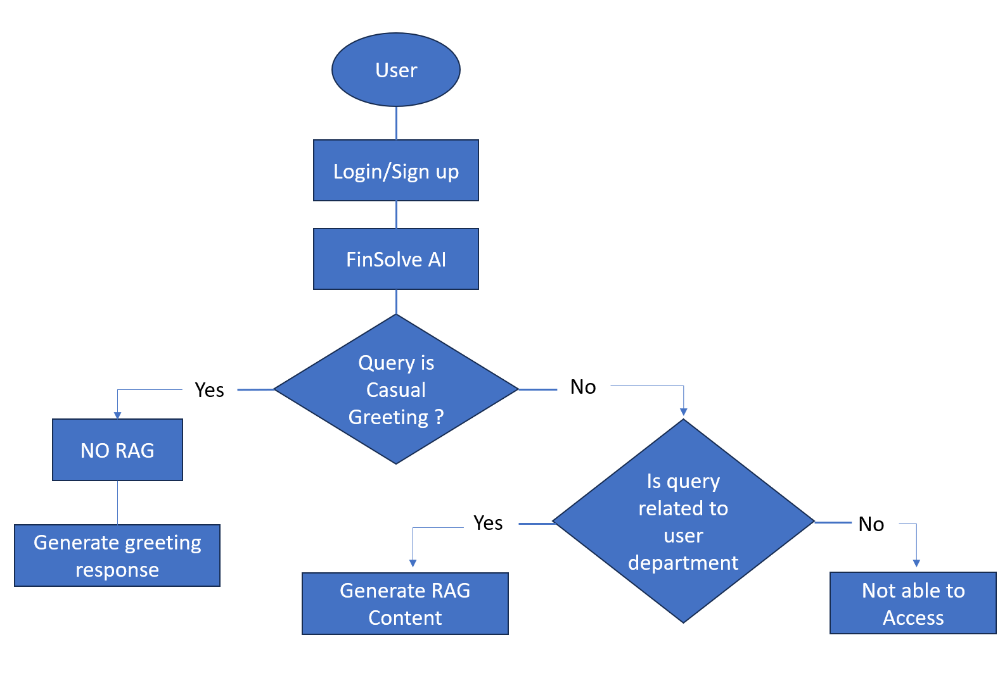

# 🧠 FinSolve AI — Role-Based GenAI Assistant (Scenario-Based FinTech Project)

## Scenario Overview

- **Company (Fictional):** FinSolve Technologies
- **Domain:** FinTech  
- **Function:** AI Engineering  
 
This project was developed as part of the **Codebasics Resume Project Challenge**, based on a real-world inspired FinTech scenario. The goal was to build a **GenAI assistant** that securely delivers department-specific information using **Role-Based Access Control (RBAC)** and **Retrieval-Augmented Generation (RAG)**.

---

## Problem Statement

FinSolve Technologies (fictitious) is a leading FinTech company offering financial solutions to individuals and businesses.

Due to siloed data access and communication delays between departments like **Finance**, **Marketing**, **HR**, **Engineering**, and **C-Level**, the company faced operational inefficiencies. To solve this, the Chief Innovation Officer proposed building a chatbot that:

- Allows secure, on-demand access to department-specific data  
- Maintains data confidentiality with role-based access  
- Responds intelligently to employee queries using company knowledge

---

## Project Goal

As the AI Engineer , your task was to design and build a secure, intelligent assistant using GenAI. The chatbot:

- Authenticates users and maps them to a department role  
- Uses RAG to provide context-aware answers  
- Restricts data access based on user role  
- Responds to casual messages without triggering RAG  
- Denies access if a user asks for information beyond their scope  

---

## 👥 User Roles & Permissions

| Role               | Permissions                                                             |
|--------------------|-------------------------------------------------------------------------|
| **Finance**        | View financial reports, expenses, reimbursements                        |
| **Marketing**      | View campaign performance, customer feedback                            |
| **HR**             | Access payroll, attendance, employee data                               |
| **Engineering**    | Access technical docs, dev process, architecture                        |
| **C-Level**        | Full unrestricted access                                                 |
| **Employee**       | View only general info like policies, events, FAQs                      |

---

## Tech Stack

- **Python** – Backend logic & orchestration  
- **FastAPI** – Web server for backend APIs  
- **LLMs** – Meta LLaMA / Google Gemini (for response generation)  
- **ChromaDB** – Vector database for document retrieval  
- **HTML/CSS/JavaScript** – Custom frontend interface  
- **Authentication** – User login & role-based routing  

---

## 🧭 Project Flow Chart

## Random User Data
| Name           | Email               | Password   | Role       |
|----------------|---------------------|------------|------------|
| Alice Johnson  | alice@company.com   | alice123   | finance    |
| Bob Smith      | bob@company.com     | bob123     | marketing  |
| Charlie Davis  | charlie@company.com | charlie123 | hr         |
| David Lee      | david@company.com   | david123   | general    |
| Eva Green      | eva@company.com     | eva1234    | marketing  |
| Frank White    | frank@company.com   | frank123   | executive  |

## Project Demo 
https://github.com/user-attachments/assets/47a5f40e-120b-4661-b48b-68d973464fe5

